<h2>1. Correct camera </h2>

	&nbsp;&nbsp;&nbsp;&nbsp;&nbsp;&nbsp;&nbsp;&nbsp;&nbsp;Use the chessboard image to get the camera's correction data, and then use it to correct the camera 
		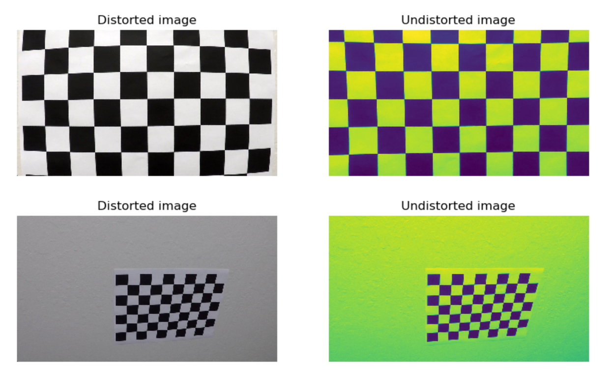 
		<h3>Comparison of board image<h3>
		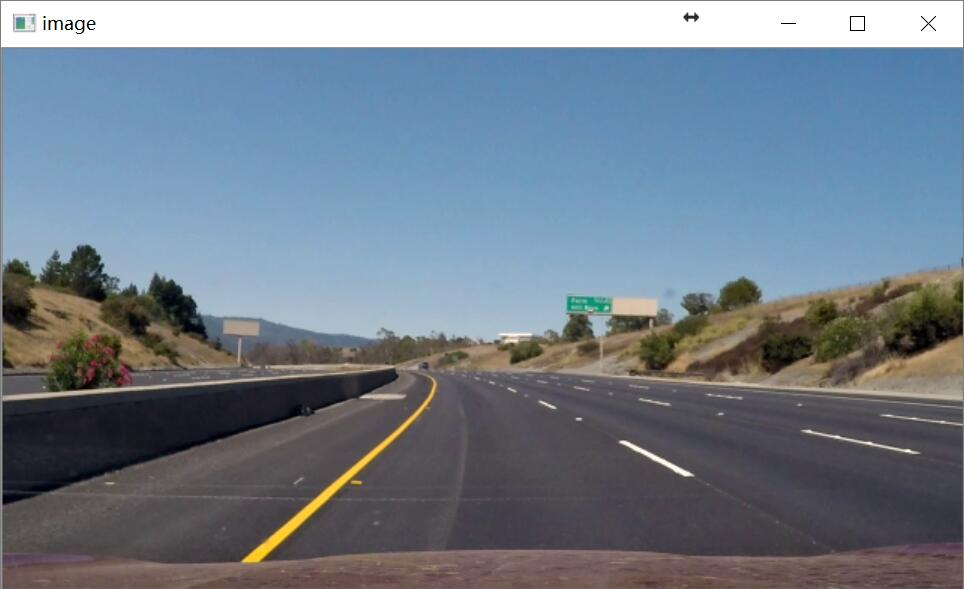 
		<h3>Uncorrected road image</h3> 
		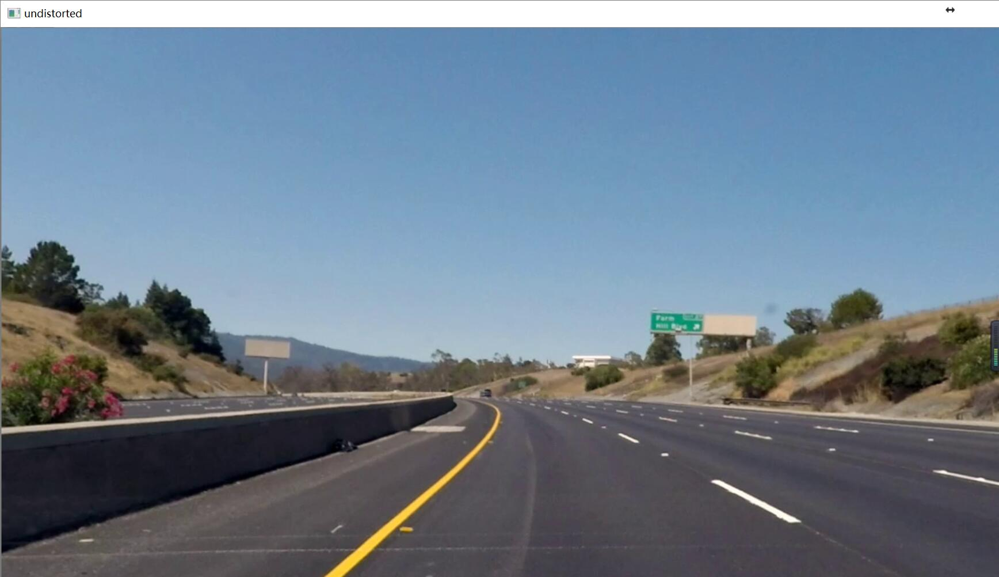 
		<h3>Corrected road image</h3> 
	

	

<h2>2. 	Region of interest</h2>

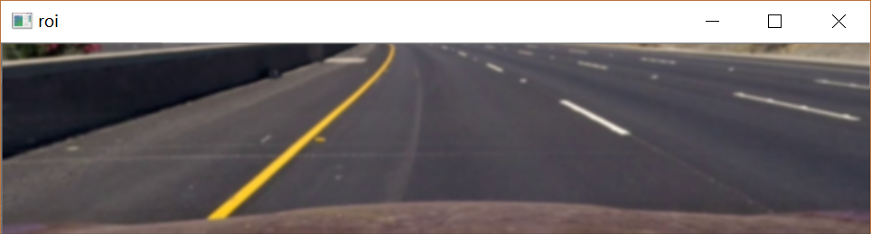 
<h3>roi image </h3>
The road information is located in the lower part of the image. In order to reduce the detection interference and improve the detection efficiency, the ROI image is cut out.

<h2>3.  Two value threshold filtering</h2>

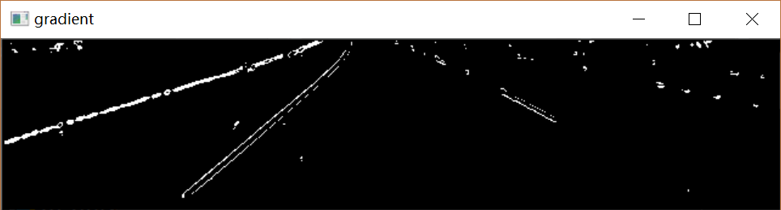 
<h3>Red channel gradient image</h3> 
The pixels from the red channel are worth the gray image, and the gradient is reduced to a two value image.  

	if transverse_axis is 'x':
        sobel_image = abs(cv2.Sobel(image, cv2.CV_64F, 1, 0))
    elif transverse_axis is 'y':
        sobel_image = abs(cv2.Sobel(image, cv2.CV_64F, 0, 1))
    else:
        print('Please enter the correct Sobel direction')
        return None
    scaled_sobel = np.uint8(255 * sobel_image / np.max(sobel_image))

    temp = threshold_filter(scaled_sobel, threshold)

**In order to solve the major mistakes of the previous version, the situation is like a picture. (thank the batch officer for the mistake here). In the project commentary, it is indicated that this may be a mistake in the two valued thresholding part. It is wrong when it is too bright or too dark. So the two values of the image will have a better result.（sobel_image / np.max(sobel_image)）** 

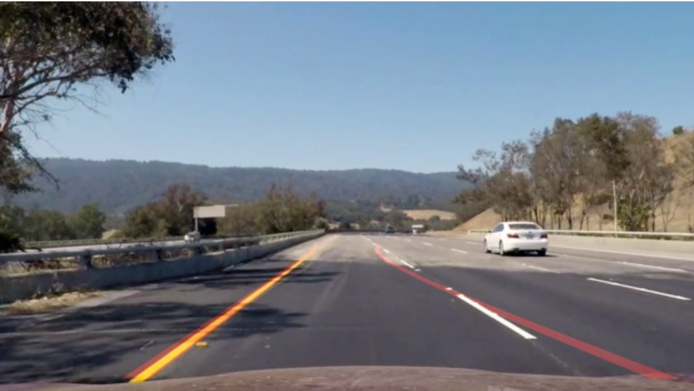

---

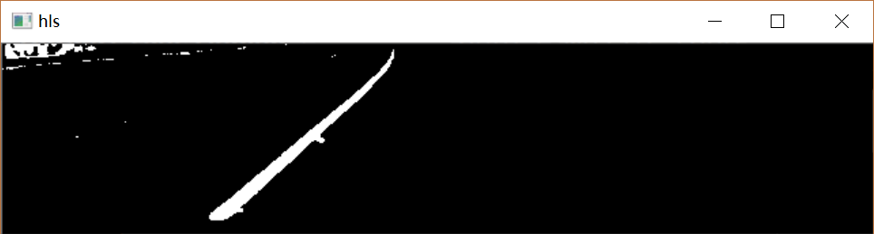 
<h3>hls image</h3> 
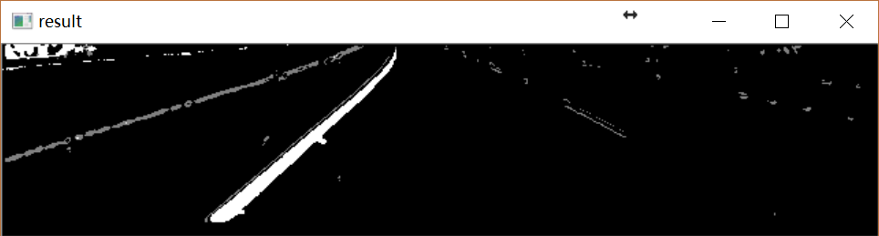 
<h3>combine image</h3> 

<h2>4.  Perspective</h2>

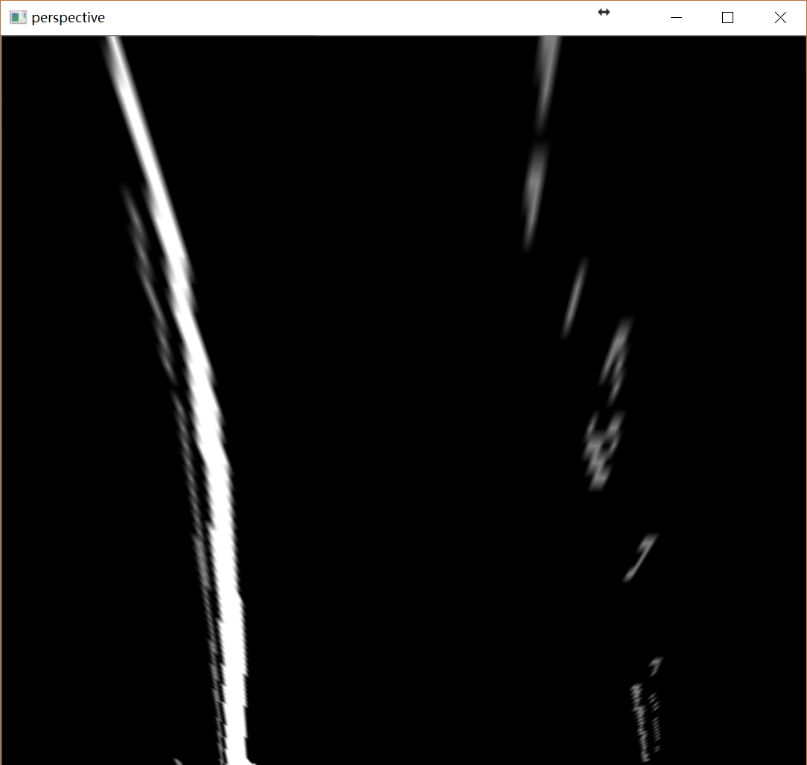 
<h3>Perspective image</h3> 
I use the trapezoidal four points I find to look into a rectangle and get an image of a pair of overlooking angles. 

	
	s_LTop2, s_RTop2 = [shape[0] / 2 - 24, 5], [shape[0] / 2 + 24, 5]
    s_LBot2, s_RBot2 = [110, shape[1]], [shape[0] - 110, shape[1]]

    src = np.float32([s_LBot2, s_LTop2, s_RTop2, s_RBot2])
    dst = np.float32([(170, 720), (170, 0), (550, 0), (550, 720)])

    mtx, dist = calibration.calib()

    f = open('temp.pkl', 'wb')
    pickle.dump(mtx, f)
    pickle.dump(dist, f)
    pickle.dump(src, f)
    pickle.dump(dst, f)
Store the point information in pickle for use at every start.

<h2>5.  Look for lane lines</h2>

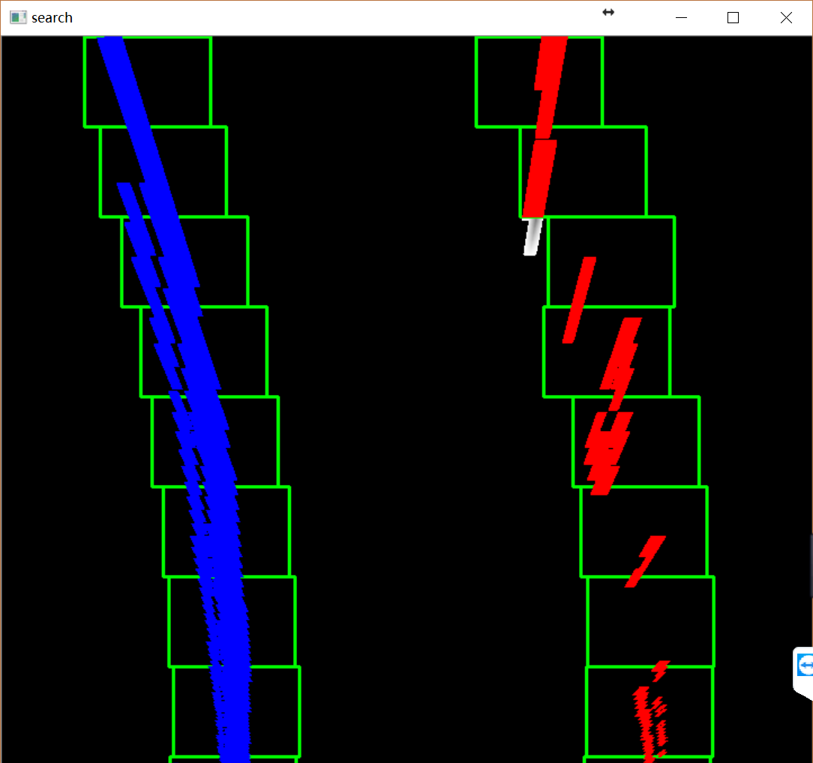 
<h3>Lane finding results</h3> 

In the video, we can predict the lane line by checking the previous frame position information. But we need another way of the first frame.
In my code, if the frame is the first or lost location, the histogram is used to find the first window position. Only the non - zero pixels are accumulated in the columns in the lower 2/3 part of the image.
In this process, we use all the non - zero pixel estimation curves of the window. Non zero piexels includes color information and gradient information in the binary image of the overlook map. It has a good performance in project_video.

<h2>6.  Draw</h2>

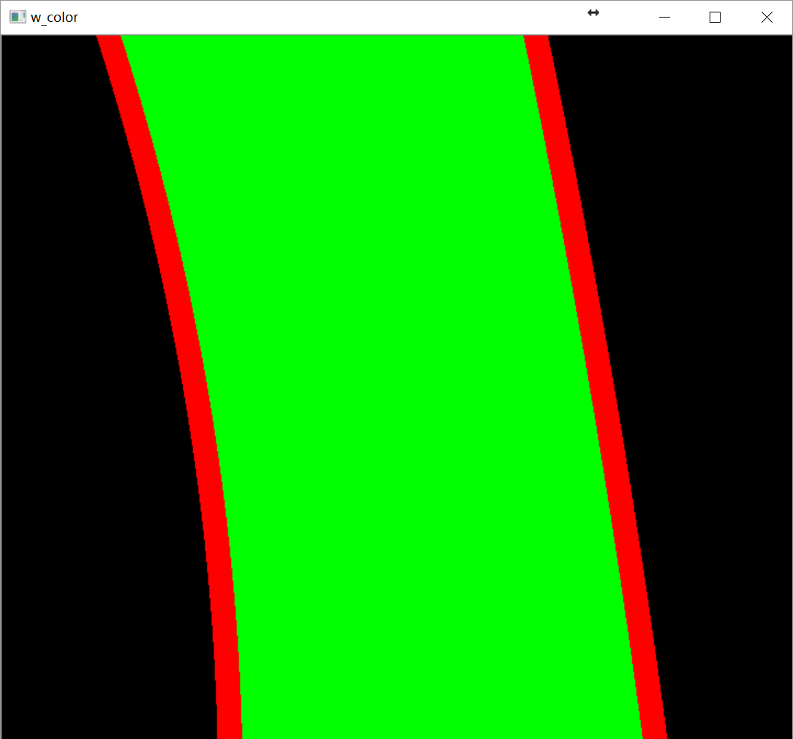 
<h3>Lane line drawing results</h3> 
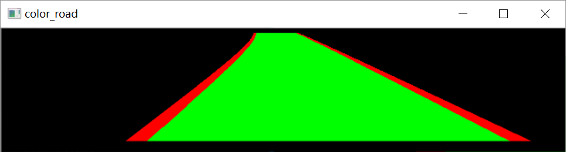 
<h3>warpPerspective</h3> 
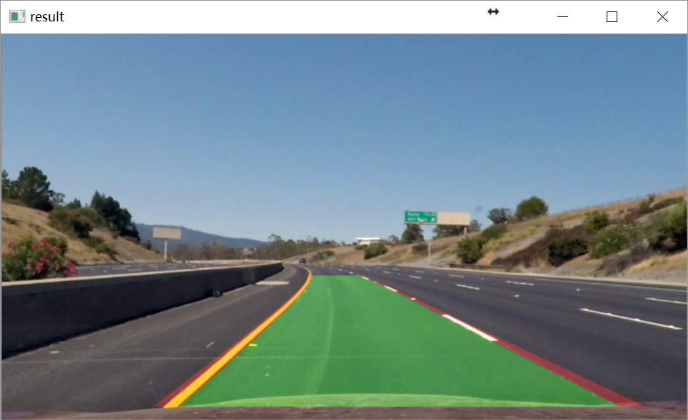 
<h3>The superposition of the original image and the results of perspective</h3> 

<h2>7.  Vehicle location information and bend radius</h2>

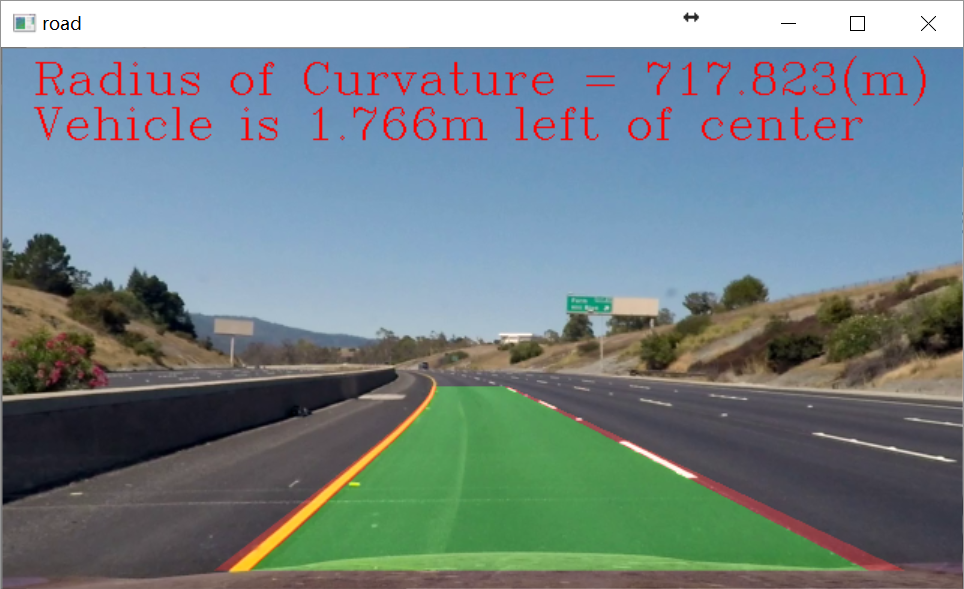 
<h3>Result image</h3> 
The curvature radius of the left and right lane lines is obtained by curve fitting and printed on the image with putText ().

    left_fit_cr = np.polyfit(ploty * ym_per_pix, leftx * xm_per_pix, 2)
    right_fit_cr = np.polyfit(ploty * ym_per_pix, rightx * xm_per_pix, 2)

Polynomial coefficients are obtained by polynomial fitting, and then the radius of curvature is calculated.

	left_curvature = ((1 + (2 * left_fit_cr[0] * y_eval * ym_per_pix + left_fit_cr[1]) ** 2) ** 1.5) / np.absolute(
        2 * left_fit_cr[0])
    right_curvature = ((1 + (2 * right_fit_cr[0] * y_eval * ym_per_pix + right_fit_cr[1]) ** 2) ** 1.5) / np.absolute(
        2 * right_fit_cr[0])

<h2>8. Discussion</h2>
- **Vehicle position detection**

In the previous version, there was an error in vehicle location detection. The image size has been reduced by half in the image preprocessing module, but when we calculate the position offset here, we still use 1280 image width (actually, because clerical error so it uses 720). 
The previous version of the code:

	center_lane = (right_line.startx + left_line.startx) / 2
    lane_width = right_line.startx - left_line.startx

    center_car = 720 / 2
    if center_lane > center_car:
        deviation = 'Left ' + str(round(abs(center_lane - center_car) / (lane_width / 2) * 100, 3)) + '%'
    elif center_lane < center_car:
        deviation = 'Right ' + str(round(abs(center_lane - center_car) / (lane_width / 2) * 100, 3)) + '%'
    else:
        deviation = 'Center'

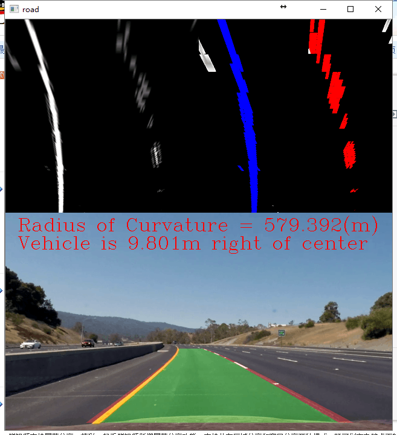

**Wrong vehicle location detection**

Current version of the code:

	center_lane = (right_line.startX - left_line.startX) / 2+left_line.startX
    lane_width = right_line.startX - left_line.startX
    xm_per_pix = 3.7 * (720 / 1280) / lane_width  # 像素/米
    center_car = 640 / 2
    if center_lane > center_car:
        deviation = 'Vehicle is ' + str(
            round(abs(center_lane - center_car) *xm_per_pix, 3)) + 'm left of center'
    elif center_lane < center_car:
        deviation = 'Vehicle is ' + str(
            round(abs(center_lane - center_car) *xm_per_pix, 3)) + 'm right of center'
    else:
        deviation = 'Center'

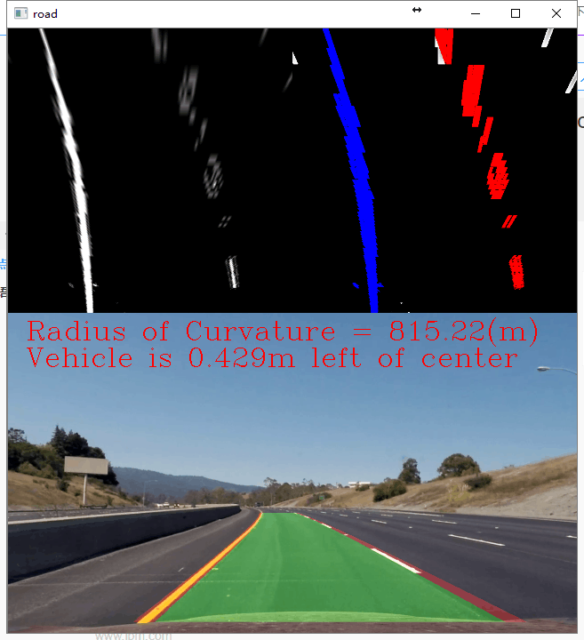

**New vehicle location detection**

In the new version, first, I used the correct image width and updated the code to calculate the number of pixels that offset the number, so as to calculate the correct position offset.

- **pipeline**

The result of using the current version in challenge_video.mp4 is poor 
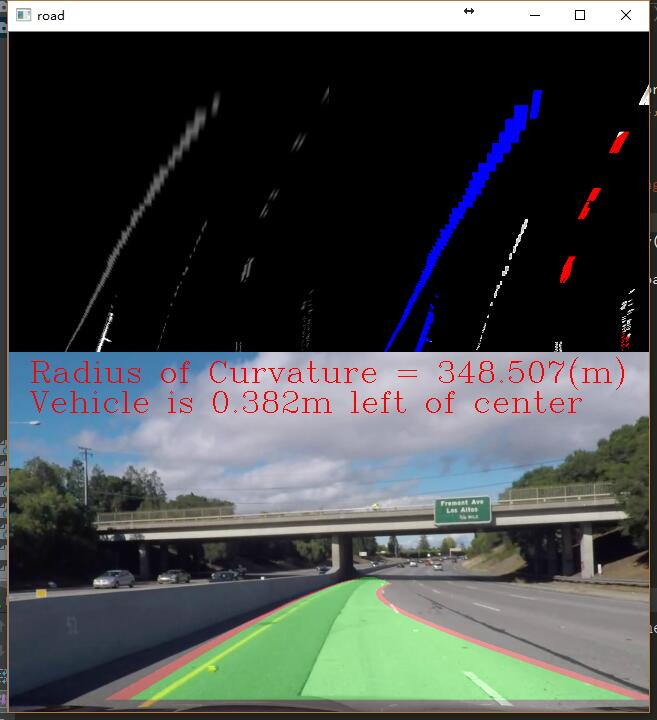 
According to the display of two valued images, it is found that the two value threshold module is not very good to filter the lane line out. 
So I think if you want to have a better performance in challenge_video.mp4, you can add a more robust filter to the two - valued image module.

